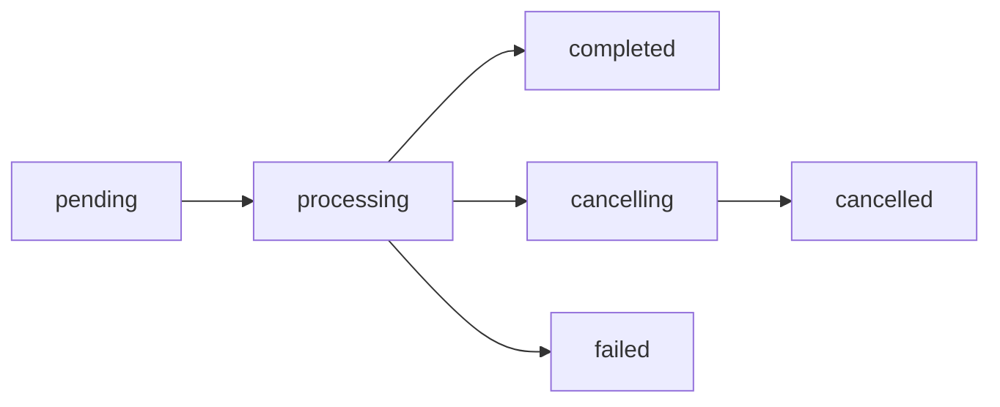

## DELETE /api/servers/:server/transfer

Cancels an outgoing server transfer that is currently in progress.

### Path Parameters

<ParamField path="server" type="string" required>
  The UUID of the server whose transfer should be cancelled
</ParamField>

### Response

Returns `202 Accepted` when the cancellation request is successfully processed.

### Error Responses

<ResponseField name="409 Conflict" type="error">
  Server is not currently being transferred
  
  ```json
  {
    "error": "Server is not currently being transferred."
  }
  ```
</ResponseField>

### Example Request

```bash cURL
curl -X DELETE https://wings.example.com/api/servers/12345678-1234-1234-1234-123456789012/transfer \
  -H "Authorization: Bearer YOUR_TOKEN"
```

```javascript JavaScript
const response = await fetch(
  'https://wings.example.com/api/servers/12345678-1234-1234-1234-123456789012/transfer',
  {
    method: 'DELETE',
    headers: {
      'Authorization': 'Bearer YOUR_TOKEN'
    }
  }
);
```

```python Python
import requests

response = requests.delete(
    'https://wings.example.com/api/servers/12345678-1234-1234-1234-123456789012/transfer',
    headers={'Authorization': 'Bearer YOUR_TOKEN'}
)
```

### Example Response

```http
HTTP/1.1 202 Accepted
```

## DELETE /api/transfers/:server

Cancels an incoming server transfer that is currently in progress on the destination node.

<Info>
  This endpoint is for cancelling incoming transfers, while the above endpoint cancels outgoing transfers. Use the appropriate endpoint based on whether you're cancelling from the source or destination node.
</Info>

### Path Parameters

<ParamField path="server" type="string" required>
  The UUID of the server whose incoming transfer should be cancelled
</ParamField>

### Response

Returns `202 Accepted` when the cancellation request is successfully processed.

### Error Responses

<ResponseField name="409 Conflict" type="error">
  Server is not currently being transferred
  
  ```json
  {
    "error": "Server is not currently being transferred."
  }
  ```
</ResponseField>

### Example Request

```bash cURL
curl -X DELETE https://destination.example.com/api/transfers/12345678-1234-1234-1234-123456789012 \
  -H "Authorization: Bearer YOUR_TOKEN"
```

```javascript JavaScript
const response = await fetch(
  'https://destination.example.com/api/transfers/12345678-1234-1234-1234-123456789012',
  {
    method: 'DELETE',
    headers: {
      'Authorization': 'Bearer YOUR_TOKEN'
    }
  }
);
```

```python Python
import requests

response = requests.delete(
    'https://destination.example.com/api/transfers/12345678-1234-1234-1234-123456789012',
    headers={'Authorization': 'Bearer YOUR_TOKEN'}
)
```

### Example Response

```http
HTTP/1.1 202 Accepted
```

## Cancellation Behavior

When you cancel a transfer:

<Steps>
  <Step title="Status Update">
    The transfer status is updated to `cancelling`
  </Step>
  
  <Step title="Context Cancellation">
    The transfer's context is cancelled, stopping all ongoing operations
  </Step>
  
  <Step title="Cleanup">
    Resources are cleaned up and the transfer is removed from the active transfers list
  </Step>
  
  <Step title="Server Unlock">
    The server's transferring flag is reset, allowing normal operations to resume
  </Step>
</Steps>

<Warning>
  Cancelling a transfer mid-stream may leave partial data on the destination node. The destination node should clean up any incomplete transfer data.
</Warning>

### Transfer Status Flow

Transfers go through these status states:



- **pending**: Transfer created but not yet started
- **processing**: Archive is being created and/or streamed
- **cancelling**: Cancellation requested, cleanup in progress
- **cancelled**: Transfer successfully cancelled
- **failed**: Transfer failed due to an error
- **completed**: Transfer finished successfully

### Status Checks

You cannot cancel a transfer that is:
- Already in the `cancelling` state
- Already `cancelled`
- Already `completed`
- Already `failed`

Attempting to cancel in these states will result in a `409 Conflict` error.

### Monitoring Cancellation

You can monitor the cancellation through the server's WebSocket connection:

```json
{
  "event": "transfer.status",
  "args": ["cancelling"]
}
```

When cancellation completes:

```json
{
  "event": "transfer.status",
  "args": ["cancelled"]
}
```

And a final log message:

```json
{
  "event": "transfer.logs",
  "args": ["[yellow][bold]Mar 04 2026 22:30:15 [Transfer System] [Source Node]:[default] Canceled."]
}
```

### Use Cases

<CardGroup cols={2}>
  <Card title="User Cancellation" icon="user">
    User decides they no longer want to transfer the server
  </Card>
  
  <Card title="Error Recovery" icon="triangle-exclamation">
    Transfer is taking too long or encountering issues
  </Card>
  
  <Card title="Node Maintenance" icon="wrench">
    Source or destination node needs to go offline
  </Card>
  
  <Card title="Resource Management" icon="gauge-high">
    Free up bandwidth or resources for other operations
  </Card>
</CardGroup>

### Related Endpoints

<CardGroup cols={2}>
  <Card title="Initiate Transfer" icon="upload" href="/api/transfers/initiate">
    Start an outgoing server transfer
  </Card>
  
  <Card title="Receive Transfer" icon="download" href="/api/transfers/status">
    Accept an incoming server transfer
  </Card>
</CardGroup>
