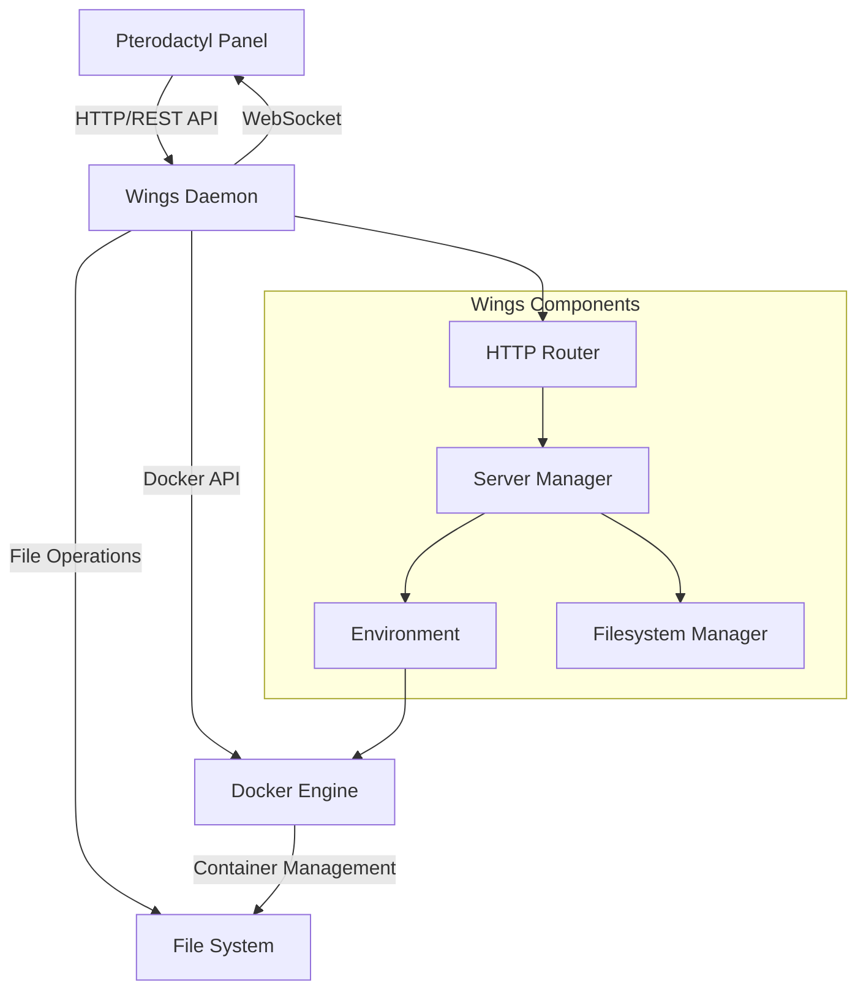
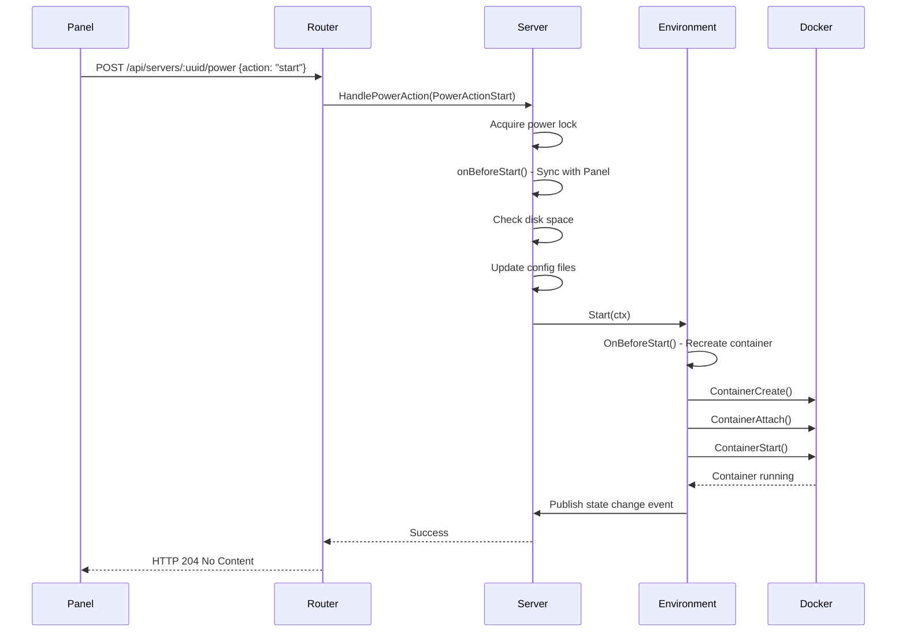

Pterodactyl Wings is the server control plane that interfaces between the Pterodactyl Panel and individual game server instances. It manages Docker containers, handles file operations, and provides real-time communication capabilities.

## System Overview

Wings operates as a standalone daemon that communicates with both the Pterodactyl Panel and Docker. It serves as the bridge that translates panel commands into container operations.



## Core Components

### Server Manager

The Server Manager (`server/manager.go:25-283`) is the central orchestrator for all server instances on a Wings node.

```go
type Manager struct {
    mu      sync.RWMutex
    client  remote.Client
    servers []*Server
}
```

**Key Responsibilities:**
- Maintains a collection of all server instances
- Initializes servers from Panel API data
- Provides thread-safe access to server instances
- Persists server states to disk

The manager uses a worker pool to initialize servers in parallel during startup:

```go
// From server/manager.go:249-250
pool := workerpool.New(runtime.NumCPU())
log.Debugf("using %d workerpools to instantiate server instances", runtime.NumCPU())
```

### HTTP Router

The router (`router/router.go:14-115`) defines all API endpoints and middleware that Wings exposes.

**Endpoint Categories:**

1. **Signed URLs** (no authentication required)
   - `/download/backup` - Download server backups
   - `/download/file` - Download server files
   - `/upload/file` - Upload files to servers

2. **WebSocket** (JWT authentication)
   - `/api/servers/:server/ws` - Real-time console access

3. **Protected API** (token authentication)
   - System information
   - Server management (CRUD operations)
   - Power actions
   - File operations
   - Backup management

### Server Instance

Each server is represented by a `Server` struct (`server/server.go:28-80`) that encapsulates all server-specific state and operations.

```go
type Server struct {
    sync.RWMutex
    ctx       context.Context
    ctxCancel *context.CancelFunc
    
    cfg         Configuration
    client      remote.Client
    crasher     CrashHandler
    Environment environment.ProcessEnvironment
    fs          *filesystem.Filesystem
    emitter     *events.Bus
    
    installing   *system.AtomicBool
    transferring *system.AtomicBool
    restoring    *system.AtomicBool
}
```

**State Management:**
- Each server has its own context for cancellation
- Thread-safe atomic booleans track ongoing operations
- Event bus for publishing state changes

## Communication Patterns

### Panel to Wings

Wings acts as an HTTP server that the Panel communicates with via REST API.

**Authentication:**
```go
// From remote/http.go:111
req.Header.Set("Authorization", fmt.Sprintf("Bearer %s.%s", c.tokenId, c.token))
```

**Request Flow:**
1. Panel sends authenticated HTTP request to Wings
2. Middleware validates authentication token
3. Middleware checks if server exists (for server-specific endpoints)
4. Request handler executes the operation
5. Response is returned to Panel

### Wings to Panel

Wings communicates back to the Panel for:
- Fetching server configurations
- Reporting installation status
- Validating SFTP credentials
- Sending activity logs

**Client Interface:**
```go
// From remote/http.go:23-36
type Client interface {
    GetBackupRemoteUploadURLs(ctx context.Context, backup string, size int64) (BackupRemoteUploadResponse, error)
    GetInstallationScript(ctx context.Context, uuid string) (InstallationScript, error)
    GetServerConfiguration(ctx context.Context, uuid string) (ServerConfigurationResponse, error)
    GetServers(context context.Context, perPage int) ([]RawServerData, error)
    SetInstallationStatus(ctx context.Context, uuid string, data InstallStatusRequest) error
    ValidateSftpCredentials(ctx context.Context, request SftpAuthRequest) (SftpAuthResponse, error)
}
```

**Retry Logic:**
Requests to the Panel use exponential backoff for resilience:

```go
// From remote/http.go:136
err := backoff.Retry(func() error {
    // Request implementation
}, backoffStrategy)
```

### Wings to Docker

Wings uses the Docker client library to manage containers.

**Connection:**
```go
// Each environment has its own Docker client
type Environment struct {
    client *client.Client  // Docker client
    Id     string          // Container name (server UUID)
}
```

**Common Operations:**
- `ContainerCreate` - Create new containers
- `ContainerStart` - Start containers
- `ContainerStop` - Stop containers gracefully
- `ContainerKill` - Forcefully terminate containers
- `ContainerAttach` - Attach to container I/O streams
- `ContainerInspect` - Get container state information

## Data Flow Example

Here's how a server start request flows through the system:



## Concurrency and Safety

### Power Action Locking

Power actions use an exclusive lock to prevent race conditions:

```go
// From server/power.go:66-104
lockId, _ := uuid.NewUUID()
if action != PowerActionTerminate {
    if err := s.powerLock.Acquire(); err != nil {
        return errors.Wrap(err, "failed to acquire exclusive lock")
    }
    defer s.powerLock.Release()
}
```

### Server Manager Thread Safety

The manager uses read-write mutexes for concurrent access:

```go
// From server/manager.go:56-60
func (m *Manager) Len() int {
    m.mu.RLock()
    defer m.mu.RUnlock()
    return len(m.servers)
}
```

### Atomic State Tracking

Server states use atomic values to avoid race conditions:

```go
// From server/server.go:105
s.resources.State = system.NewAtomicString(environment.ProcessOfflineState)
```

## Configuration Syncing

Servers sync their configuration with the Panel at critical points:

1. **On Startup** - When Wings boots, all servers fetch latest config
2. **Before Start** - Ensures latest settings before booting server
3. **On Explicit Sync** - Manual sync operations from Panel

```go
// From server/server.go:186-216
func (s *Server) Sync() error {
    cfg, err := s.client.GetServerConfiguration(s.Context(), s.ID())
    if err != nil {
        return errors.WithStackIf(err)
    }
    
    if err := s.SyncWithConfiguration(cfg); err != nil {
        return errors.WithStackIf(err)
    }
    
    s.fs.SetDiskLimit(s.DiskSpace())
    s.SyncWithEnvironment()
    
    if s.IsSuspended() {
        s.Websockets().CancelAll()
        s.Sftp().CancelAll()
    }
    
    return nil
}
```

## State Persistence

Wings persists server states to disk to survive restarts:

```go
// From server/manager.go:148-161
func (m *Manager) PersistStates() error {
    states := map[string]string{}
    for _, s := range m.All() {
        states[s.ID()] = s.Environment.State()
    }
    data, err := json.Marshal(states)
    if err != nil {
        return errors.WithStack(err)
    }
    return os.WriteFile(config.Get().System.GetStatesPath(), data, 0o644)
}
```

This is called periodically to ensure states are saved without overwhelming disk I/O.

## Next Steps

<CardGroup cols={2}>
  <Card title="Server Lifecycle" icon="arrows-rotate" href="/concepts/server-lifecycle">
    Learn about server states and transitions
  </Card>
  <Card title="Docker Integration" icon="docker" href="/concepts/docker-integration">
    Understand how Wings uses Docker
  </Card>
  <Card title="File Management" icon="folder" href="/concepts/file-management">
    Explore filesystem operations
  </Card>
</CardGroup>