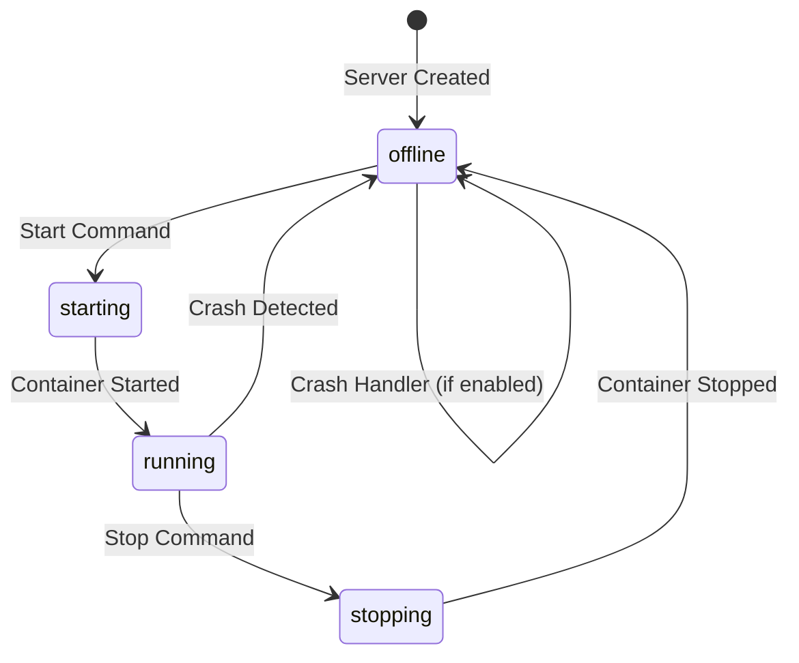
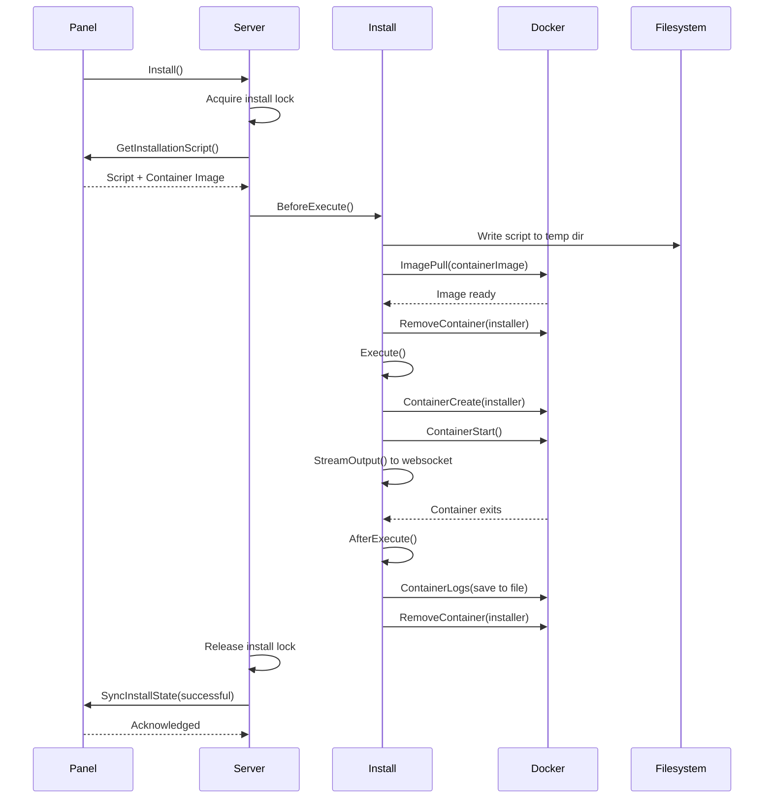
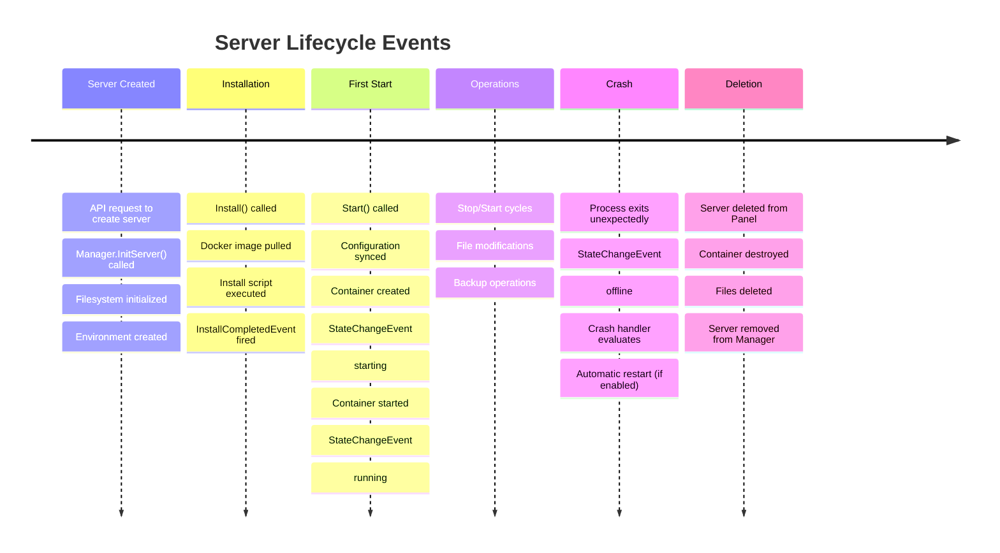

A Pterodactyl server instance goes through multiple states throughout its lifecycle, from installation to deletion. Understanding these states and transitions is crucial for developing integrations and troubleshooting issues.

## Server States

Wings tracks server states using atomic strings to ensure thread-safe state management.

### Environment States

These are the core states defined in `environment/environment.go:18-23`:

```go
const (
    ProcessOfflineState  = "offline"
    ProcessStartingState = "starting"
    ProcessRunningState  = "running"
    ProcessStoppingState = "stopping"
)
```

**State Diagram:**



### Additional Operation States

Servers also track special operation states using atomic booleans:

```go
// From server/server.go:63-65
installing   *system.AtomicBool
transferring *system.AtomicBool
restoring    *system.AtomicBool
```

These prevent conflicting operations from running simultaneously.

## Installation Process

The installation process is a critical part of a server's lifecycle. It prepares the server environment and runs setup scripts.

### Installation Flow



### Installation Container Configuration

Installation runs in a temporary Docker container separate from the server's runtime container:

```go
// From server/install.go:399-413
conf := &container.Config{
    Hostname:     "installer",
    AttachStdout: true,
    AttachStderr: true,
    AttachStdin:  true,
    OpenStdin:    true,
    Tty:          true,
    Cmd:          []string{ip.Script.Entrypoint, "/mnt/install/install.sh"},
    Image:        ip.Script.ContainerImage,
    Env:          ip.Server.GetEnvironmentVariables(),
    Labels: map[string]string{
        "Service":       "Pterodactyl",
        "ContainerType": "server_installer",
    },
}
```

**Key Mounts:**
- `/mnt/server` - Server's data directory (read-write)
- `/mnt/install` - Installation script location (read-write)

### Resource Limits During Installation

Installation containers use the higher of server limits or global installer limits:

```go
// From server/install.go:524-541
func (ip *InstallationProcess) resourceLimits() container.Resources {
    limits := config.Get().Docker.InstallerLimits
    cfg := c.Build
    
    if cfg.MemoryLimit < limits.Memory {
        cfg.MemoryLimit = limits.Memory
    }
    
    if limits.Cpu == 0 {
        cfg.CpuLimit = 0
    } else if cfg.CpuLimit != 0 && cfg.CpuLimit < limits.Cpu {
        cfg.CpuLimit = limits.Cpu
    }
    
    return cfg.AsContainerResources()
}
```

This prevents servers with very low limits from failing installation while avoiding excessive resource usage.

## Power Actions

Power actions control the server's running state. They are protected by an exclusive lock to prevent race conditions.

### Power Action Types

```go
// From server/power.go:24-29
const (
    PowerActionStart     = "start"
    PowerActionStop      = "stop"
    PowerActionRestart   = "restart"
    PowerActionTerminate = "kill"
)
```

### Start Process

Starting a server involves several pre-flight checks:

```go
// From server/power.go:171-218
func (s *Server) onBeforeStart() error {
    // 1. Sync with Panel for latest configuration
    if err := s.Sync(); err != nil {
        return errors.WithMessage(err, "unable to sync server data")
    }
    
    // 2. Check if server is suspended
    if s.IsSuspended() {
        return ErrSuspended
    }
    
    // 3. Sync environment variables and resource limits
    s.SyncWithEnvironment()
    
    // 4. Check disk space availability
    if s.DiskSpace() > 0 {
        if err := s.Filesystem().HasSpaceErr(false); err != nil {
            return err
        }
    }
    
    // 5. Update configuration files
    s.UpdateConfigurationFiles()
    
    // 6. Set correct file permissions (if enabled)
    if config.Get().System.CheckPermissionsOnBoot {
        if err := s.Filesystem().Chown("/"); err != nil {
            return err
        }
    }
    
    return nil
}
```

### Stop Process

Stopping can be done via command or signal, depending on server configuration:

```go
// From environment/docker/power.go:139-204
func (e *Environment) Stop(ctx context.Context) error {
    e.SetState(environment.ProcessStoppingState)
    
    // Signal-based stop
    if s.Type == remote.ProcessStopSignal {
        return e.SignalContainer(ctx, s.Value)
    }
    
    // Command-based stop (send stop command to stdin)
    if e.IsAttached() && s.Type == remote.ProcessStopCommand {
        return e.SendCommand(s.Value)
    }
    
    // Fallback to native Docker stop (SIGTERM)
    timeout := -1  // Indefinite timeout for graceful shutdown
    return e.client.ContainerStop(ctx, e.Id, container.StopOptions{Timeout: &timeout})
}
```

### Restart Process

Restart is implemented as a stop followed by a start:

```go
// From server/power.go:137-161
case PowerActionRestart:
    // Wait for complete stop (up to 10 minutes)
    if err := s.Environment.WaitForStop(s.Context(), time.Minute*10, true); err != nil {
        return err
    }
    
    // Run pre-boot logic
    if err := s.onBeforeStart(); err != nil {
        return err
    }
    
    return s.Environment.Start(s.Context())
```

### Terminate Process

Termination bypasses the power lock for emergency situations:

```go
// From server/power.go:108-121
if action == PowerActionTerminate {
    // Try to acquire lock but don't fail if unavailable
    if err := s.powerLock.Acquire(); err == nil {
        defer cleanup()
    } else {
        log.Warn("failed to acquire exclusive lock, ignoring for termination")
    }
}
```

Termination sends SIGKILL to immediately stop the container:

```go
// From environment/docker/power.go:311-322
func (e *Environment) Terminate(ctx context.Context, signal string) error {
    if err := e.SignalContainer(ctx, signal); err != nil {
        return errors.WithStack(err)
    }
    
    // Immediately mark as offline
    e.SetState(environment.ProcessOfflineState)
    return nil
}
```

## Crash Detection and Recovery

Wings includes automatic crash detection and restart capabilities.

### Crash Detection Logic

```go
// From server/server.go:345-358
if (prevState == environment.ProcessStartingState || 
    prevState == environment.ProcessRunningState) && 
    s.Environment.State() == environment.ProcessOfflineState {
    
    s.Log().Info("detected server as entering a crashed state")
    
    go func(server *Server) {
        if err := server.handleServerCrash(); err != nil {
            if IsTooFrequentCrashError(err) {
                server.Log().Info("did not restart after crash")
            }
        }
    }(s)
}
```

### Crash Handler

The crash handler determines if a restart should occur:

```go
// From server/crash.go:47-91
func (s *Server) handleServerCrash() error {
    // Skip if crash detection disabled
    if !s.Config().CrashDetectionEnabled {
        return nil
    }
    
    exitCode, oomKilled, err := s.Environment.ExitState()
    if err != nil {
        return err
    }
    
    // Clean exit code handling
    if exitCode == 0 && !oomKilled && 
       !config.Get().System.CrashDetection.DetectCleanExitAsCrash {
        return nil
    }
    
    s.PublishConsoleOutputFromDaemon("---------- Detected crash! ----------")
    s.PublishConsoleOutputFromDaemon(fmt.Sprintf("Exit code: %d", exitCode))
    s.PublishConsoleOutputFromDaemon(fmt.Sprintf("Out of memory: %t", oomKilled))
    
    // Check crash frequency
    lastCrash := s.crasher.LastCrashTime()
    timeout := config.Get().System.CrashDetection.Timeout
    
    if timeout != 0 && !lastCrash.IsZero() && 
       lastCrash.Add(time.Second*time.Duration(timeout)).After(time.Now()) {
        return &crashTooFrequent{}
    }
    
    s.crasher.SetLastCrash(time.Now())
    
    // Attempt restart
    return s.HandlePowerAction(PowerActionStart)
}
```

**Crash Detection Configuration:**
- `DetectCleanExitAsCrash` - Whether exit code 0 counts as a crash
- `Timeout` - Minimum seconds between crashes to allow restart
- Setting timeout to 0 always allows restart

## State Change Events

State changes trigger events that can be subscribed to:

```go
// From server/server.go:317-336
func (s *Server) OnStateChange() {
    prevState := s.resources.State.Load()
    st := s.Environment.State()
    
    // Update tracked state
    s.resources.State.Store(st)
    
    // Emit event if state changed
    if prevState != st {
        s.Log().WithField("status", st).Debug("saw server status change")
        s.Events().Publish(StatusEvent, st)
    }
    
    // Reset resource usage on offline
    if st == environment.ProcessOfflineState {
        s.resources.Reset()
        s.Events().Publish(StatsEvent, s.Proc())
    }
    
    // Handle crash detection
    // ...
}
```

## Reinstallation

Reinstallation reruns the installation process without deleting server files:

```go
// From server/install.go:80-94
func (s *Server) Reinstall() error {
    // Ensure server is stopped
    if s.Environment.State() != environment.ProcessOfflineState {
        if err := s.Environment.WaitForStop(s.Context(), time.Second*10, true); err != nil {
            return errors.WrapIf(err, "install: failed to stop running environment")
        }
    }
    
    // Sync latest configuration
    if err := s.Sync(); err != nil {
        return errors.WrapIf(err, "install: failed to sync server state")
    }
    
    return s.install(true)  // true = reinstall flag
}
```

## Transfer State

Servers being transferred between nodes have special state handling:

```go
// From server/install.go:146-160
func (s *Server) IsTransferring() bool {
    return s.transferring.Load()
}

func (s *Server) SetTransferring(state bool) {
    s.transferring.Store(state)
}
```

During transfers:
- Server is marked as transferring
- Power actions are blocked
- Archive is created and sent to target node
- Target node extracts and starts server

## Lifecycle Events Timeline



## Next Steps

<CardGroup cols={2}>
  <Card title="Architecture" icon="diagram-project" href="/concepts/architecture">
    Understand the overall system architecture
  </Card>
  <Card title="Docker Integration" icon="docker" href="/concepts/docker-integration">
    Learn how Wings manages Docker containers
  </Card>
  <Card title="File Management" icon="folder" href="/concepts/file-management">
    Explore filesystem operations
  </Card>
</CardGroup>